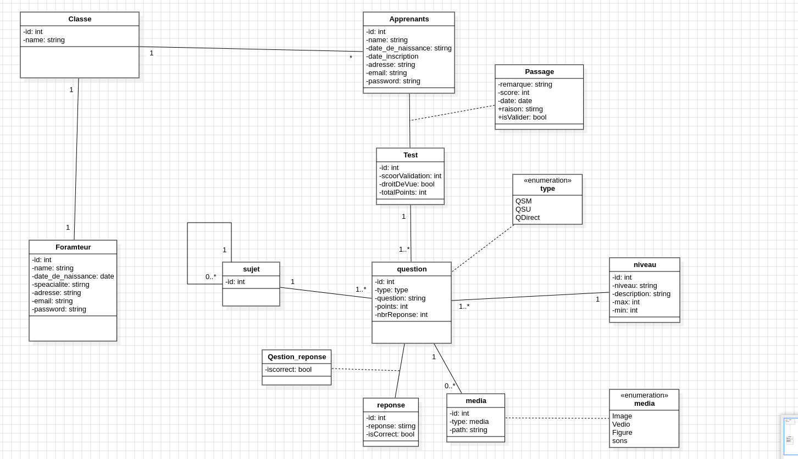
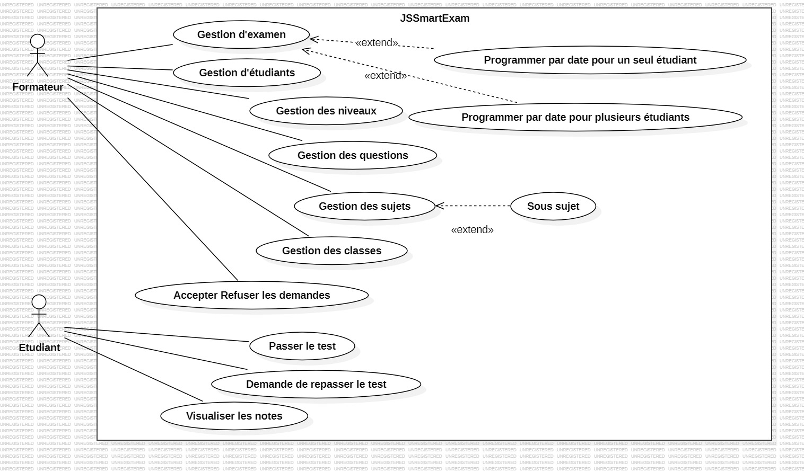

# JSSmartExam

## Description
Ce projet est un système de gestion des examens. Il permet aux formateurs de créer des classes, des étudiants, des tests, des sujets, des sous-sujets, et des questions. Les étudiants peuvent passer des examens.

## UML Diagram

- **Diagramme De Classe**
  

- **Diagramme Use Case**
  

## Figma
- [](https://www.figma.com/design/g9UyICzi7AxSOhcFt2yHE9/Untitled?node-id=0-1&node-type=canvas&t=ISiMhJOhlOdgITiN-0) [Lien vers le projet Figma](https://www.figma.com/design/g9UyICzi7AxSOhcFt2yHE9/Untitled?node-id=0-1&node-type=canvas&t=ISiMhJOhlOdgITiN-0)

## Jira
- [](https://sagim.atlassian.net/jira/software/projects/JQ/boards/2/backlog) [Lien vers le projet Jira](https://sagim.atlassian.net/jira/software/projects/JQ/boards/2/backlog)

## Utilisation
- **Formateurs** : Créer des classes, des étudiants, des tests, des sujets, des sous-sujets, et des questions.
- **Étudiants** : Passer des examens.

## Technologies Utilisées
- **Backend** : Node.js avec Express
- **FrontEnd** : EJS template engine

## Dépendances
Le projet utilise les dépendances suivantes :
```json
{
  "bcryptjs": "^2.4.3",
  "dotenv": "^16.4.5",
  "ejs": "^3.1.10",
  "express": "^4.19.2",
  "express-mysql-session": "^3.0.3",
  "express-session": "^1.18.0",
  "express-validator": "^7.2.0",
  "method-override": "^3.0.0",
  "morgan": "^1.10.0",
  "mysql2": "^3.11.1",
  "nodemailer": "^6.9.15",
  "sweetalert2": "^11.13.3"
}
